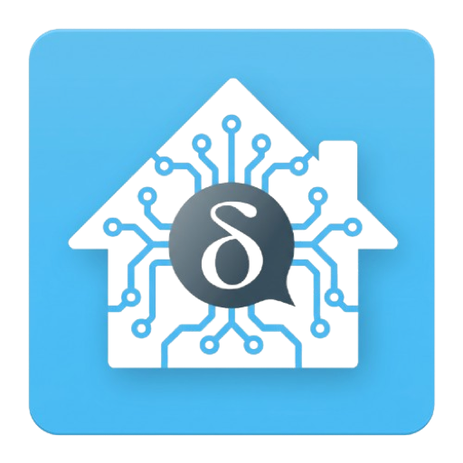

# Delta Chat Bots for Home Assistant

<p align="center">
  
</p>

<p align="center">
  <b>A curated collection of production-ready <a href="https://delta.chat">Delta Chat</a> bots packaged as official Home Assistant Add-ons.</b>
</p>

<p align="center">
  <a href="https://my.home-assistant.io/redirect/supervisor_add_addon_repository/?repository_url=https%3A%2F%2Fgithub.com%2Fmrgluek%2Fhass-addons-deltachat"></a>
</p>

<p align="center">
  
  
  
</p>

---

## 📦 Available Add-ons

| Add-on | Slug | Description | Web UI / Sidebar |
| :--- | :--- | :--- | :---: |
| **[Uptime Bot](addons/uptime)** | `deltachat_uptime` | Monitors websites, ports & SSL expiry with instant Delta Chat alerts and web status dashboard | **Ingress** / Port `8081` |
| **[Telegram Bridge](addons/telegram_bridge)** | `deltachat_telegram_bridge` | Bidirectional message, edit, deletion, and media bridge between Telegram and Delta Chat | No |
| **[Web Preview](addons/webpreview)** | `deltachat_webpreview` | Saves web pages as offline HTML (`monolith`), reader mode views, WebXDC apps & Gemini AI summaries | No |
| **[Bouncer](addons/bouncer)** | `deltachat_bouncer` | Monitors group inactivity, purges stale members, manages group/channel catalogs, and tests relays (`cmping`) | No |
| **[ntfy Notifications](addons/ntfy)** | `deltachat_ntfy` | Emulates ntfy.sh backend to broadcast HTTP webhooks to Delta Chat topics with a web dashboard | **Ingress** / Port `8082` |
| **[YT Downloader](addons/yt)** | `deltachat_yt` | Downloads media & music (Yandex Music, SoundCloud, VK), slices tracks, and integrates with Navidrome | No |
| **[Username & Short Links](addons/username)** | `deltachat_username` | Registers custom usernames and short invite redirect links (HTTP 307) with OpenGraph preview cards | **Ingress** / Port `8084` |
| **[Publish Bot](addons/publish)** | `deltachat_publish` | Publishes blog posts and images to Astro blogs via Forgejo / Gitea REST API with single-commit publishing | No |

---

## 🚀 Installation

### One-Click Install
Click the My Home Assistant badge above, or use this button:

[](https://my.home-assistant.io/redirect/supervisor_add_addon_repository/?repository_url=https%3A%2F%2Fgithub.com%2Fmrgluek%2Fhass-addons-deltachat)

### Manual Install
1. In Home Assistant, go to **Settings** → **Add-ons** → **Add-on Store** (bottom-right button).
2. Click the three dots (top-right menu) → **Repositories**.
3. Add the following repository URL:
   ```text
   https://github.com/mrgluek/hass-addons-deltachat
   ```
4. Click **Add** and then close the dialog.
5. Refresh the page or click **Check for updates**. The **Delta Chat Bots** section will appear in the Add-on Store!

---

## ⚙️ Configuration & Quick Start

Each bot includes a built-in setup wizard in its **Configuration** tab in Home Assistant:

1. **Install the Bot**: Choose the desired bot and click **Install**.
2. **Configure Credentials**: Open the **Configuration** tab. You can connect your bot using either:
   - **Chatmail QR / URI** *(Recommended)*: Paste a `DCACCOUNT:...` invite string or QR text from any Chatmail server into the `chatmail_qr` field.
   - **Standard E-mail**: Enter `email` and `password` (and optional IMAP/SMTP server/port if using custom domains).
3. **Set Admin & Profile**:
   - `admin_email`: Your personal Delta Chat email address.
   - `display_name`: Friendly name displayed in chats (e.g. `Home Uptime Bot`).
   - `status_text`: Bio text shown in the bot profile.
4. **Sidebar & Web UI**: For bots with a web interface (`Uptime`, `ntfy`, `Username`), enable the **Show in sidebar** toggle to access the web UI directly from Home Assistant's left navigation menu via Home Assistant Ingress without port conflicts!
5. **Start the Add-on**: Click **Start**.
6. **Connect via Delta Chat**:
   - Open the **Log** tab of the add-on.
   - You will see the bot's invitation link and an **ASCII QR Code** directly in the logs!
   - Open Delta Chat on your phone or desktop, scan the QR code (or paste the invite link), and you are connected!

---

## 🛡️ Architecture & Deployment

- **Home Assistant Ingress**: Web UIs are securely embedded into the Home Assistant frontend and sidebar without requiring open host ports or router port forwarding.
- **Pre-built Multi-Arch Containers**: Images are built for `linux/amd64` and `linux/arm64` (aarch64) and hosted on `ghcr.io/mrgluek/`.
- **Automatic Fallback**: If `ghcr.io` images are not available, Home Assistant builds from the local `Dockerfile` by pulling from GitHub with an automatic fallback to the self-hosted Forgejo mirror at `https://git.gluek.info/gluek/`.
- **Persistent Data**: All account keys, SQLite databases, and configurations are safely stored in `/data`, persisting across container restarts and add-on updates.

---

## 📄 License

This project is released into the public domain under [The Unlicense](LICENSE).
